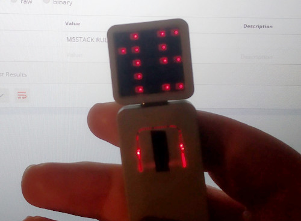

# Atomic Text
Quick and dirty tool to scroll messages on an M5Stack Atom.

## Usage
1) Open the source folder in the [PlatformIO](https://platformio.org/) IDE
1) Set your WiFi network SSID and PASSWORD in main.cpp.
1) Upload using the PlatformIO Upload button (which will also do a build first).
1) POST to the endpoint http://atomictext.local/m with the KEY "text" and your message as the VALUE. 

You can also use GET (e.g. ?text=HELLO) but spaces are treated as URL ENCODED so not recommended.

Note: mobile devices may not support mDNS which is used to set the domain name "atomictext.local" on your network - so you may need to find the IP address on your router instead.

## Limitations
Only horziontal scroll to the left is supported currently as earlier revisions used the
official unstable M5Atom library 0.0.1 animation API which despite supporting scroll in many 
directions had memory corruption issues and would crash.
The font used in this library could do with work - any improvements on design and usage 
appreciated (bear in mind it's 5x5 pixels)!
There appears to be an interrupt bug causing the LEDs to flicker slighlty on scroll - I've not 
yet identified what setting or code is causing this issue (it doesn't appear to be a scope issue).

## TODO
- Maybe add some more configuration options (brightness is hardcoded to prevent M5Atom damage).
- Maybe add glyph support.
